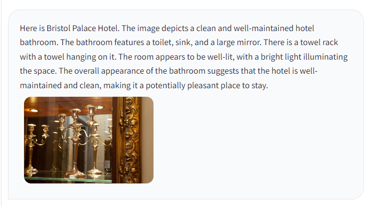
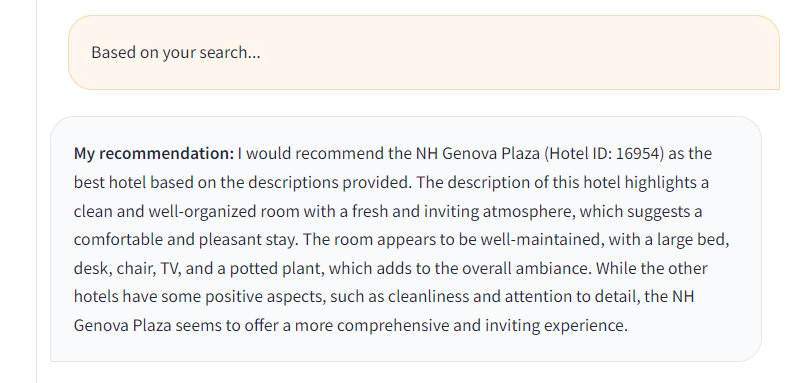

# How to Use Multimodal LLava with WatsonX.ai

In this project, we will demonstrate how to build an interesting application that recommends hotels. The application will generate descriptions of hotel photos using LLava and add these descriptions to a new column named `multimodal_description`. With WatsonX.ai, you can read all descriptions and, based on your custom preferences, choose the best 5 places to book and describe the photos of the hotel.

## Setup

First, let's install the necessary libraries:

```bash
pip install pandas numpy haversine requests Pillow transformers accelerate bitsandbytes
```

## Finding Nearby Hotels

The following Python function finds nearby hotels based on a given place or the current location using the Haversine formula to calculate distances.

```python
import pandas as pd
import numpy as np
import requests
from haversine import haversine
import os

from geopy.geocoders import Nominatim

def get_coordinates(location_name):
    """Fetches latitude and longitude coordinates for a given location name.

    Args:
        location_name (str): The name of the location (e.g., "Rome, Italy").

    Returns:
        tuple: A tuple containing the latitude and longitude (float values),
               or None if the location is not found.
    """

    geolocator = Nominatim(user_agent="coordinate_finder")
    location = geolocator.geocode(location_name)

    if location:
        return location.latitude, location.longitude
    else:
        return None  # Location not found
import requests

def get_current_location():
    try:
        response = requests.get('https://ipinfo.io/json')
        data = response.json()
        
        location = data.get('loc', '')
        if location:
            latitude, longitude = map(float, location.split(','))
            return latitude, longitude
        else:
            return None, None
    except Exception as e:
        print(f"An error occurred: {e}")
        return None, None

latitude, longitude = get_current_location()
if latitude and longitude:
    print(f"Current location: Latitude = {latitude}, Longitude = {longitude}")
else:
    print("Could not retrieve the current location.")


def find_nearby(place=None):
    if place:
        coordinates = get_coordinates(place)
        if coordinates:
            latitude, longitude = coordinates
            print(f"The coordinates of {place} are: Latitude: {latitude}, Longitude: {longitude}")
        else:
            print(f"Location not found: {place}")
            return pd.DataFrame()
    else:
        latitude, longitude = get_current_location()
        if latitude and longitude:
            print(f"Current location: Latitude = {latitude}, Longitude = {longitude}")
        else:
            print("Could not determine current location.")
            return pd.DataFrame()

    # Load the geocoded_hotels DataFrame
    current_directory = os.getcwd()
    geocoded_hotels_path = os.path.join(current_directory, 'geocoded_hotels.csv')
    geocoded_hotels = pd.read_csv(geocoded_hotels_path)

    # Calculate distances to all other points in the DataFrame
    geocoded_hotels['distance_km'] = geocoded_hotels.apply(
        lambda row: haversine((latitude, longitude), (row['latitude'], row['longitude'])),
        axis=1
    )

    # Sort by distance and get the top 5 closest points
    closest_hotels = geocoded_hotels.sort_values(by='distance_km').head(5)

    # Display the results
    print("The 5 closest locations are:\n")
    print(closest_hotels)
    return closest_hotels

# Example usage:
place = "Genova, Italy"
df_found = find_nearby(place)
```

## Generating Descriptions with LLava

We will use LLava, a multimodal LLM, to generate descriptions of the first two images for each recommended hotel.

### Set-up Environment

Let's start by installing the necessary libraries. This enables 4-bit inference with clever quantization techniques, shrinking the size of the model considerably, while maintaining performance of the original size.

```bash
pip3 install torch torchvision torchaudio --index-url https://download.pytorch.org/whl/cu121

pip install --upgrade -q accelerate bitsandbytes
pip install git+https://github.com/huggingface/transformers.git
```

### Load Model and Processor

Next, we load a model and corresponding processor from the hub.

```python
from transformers import AutoProcessor, LlavaForConditionalGeneration
from transformers import BitsAndBytesConfig
import torch

quantization_config = BitsAndBytesConfig(
    load_in_4bit=True,
    bnb_4bit_compute_dtype=torch.float16
)

model_id = "llava-hf/llava-1.5-7b-hf"

processor = AutoProcessor.from_pretrained(model_id)
model = LlavaForConditionalGeneration.from_pretrained(model_id, quantization_config=quantization_config, device_map="auto")
```

### Prepare Images and Text for the Model

```python
import requests
from PIL import Image

image1 = Image.open(requests.get("https://llava-vl.github.io/static/images/view.jpg", stream=True).raw)
image2 = Image.open(requests.get("http://images.cocodataset.org/val2017/000000039769.jpg", stream=True).raw)
display(image1)
display(image2)
```

### Generate Descriptions

In the prompt, you can refer to images using the special `<image>` token.

```python
prompts = [
    "USER: <image>\nDescribe this image.\nASSISTANT:"
]

inputs = processor(images=[image1, image2], text=prompts, return_tensors="pt", padding=True)
output = model.generate(**inputs, max_new_tokens=20)
generated_text = processor.batch_decode(output, skip_special_tokens=True)
for text in generated_text:
    print(text.split("ASSISTANT:")[-1])
```

### Pipeline API

Alternatively, you can leverage the pipeline API which abstracts all of the logic above away for the user.

```python
from transformers import pipeline

pipe = pipeline("image-to-text", model=model_id, model_kwargs={"quantization_config": quantization_config})

outputs = pipe([image1, image2], max_new_tokens=200, prompt="Describe this image.")
for output in outputs:
    print(output["generated_text"])
```

## Repository Overview

- `find_nearby()`: Function to find nearby hotels based on a given place or current location.
- `geocoded_hotels.csv`: CSV file containing hotel data with geocoded coordinates.
- `LLaVa`: Multimodal LLM used to generate descriptions for hotel images.

## Resources

- [Transformers Documentation](https://huggingface.co/docs/transformers/main/en/model_doc/llava)
- [Original LLaVa Paper](https://arxiv.org/abs/2304.08485)
- [LLaVa 1.5 Paper](https://arxiv.org/pdf/2310.03744.pdf)

## Installation

To set up the environment and install necessary libraries, run:

```bash
pip install pandas numpy haversine requests Pillow transformers accelerate bitsandbytes
pip install git+https://github.com/huggingface/transformers.git
```

## Usage

1. Find nearby hotels:
    ```python
    df_found = find_nearby("Genova, Italy")
    ```

2. Generate descriptions for the first two images of each recommended hotel using LLava:
    ```python
    # Load images and generate descriptions
    image1 = Image.open(requests.get("<image_url1>", stream=True).raw)
    image2 = Image.open(requests.get("<image_url2>", stream=True).raw)
    display(image1)
    display(image2)

    prompts = [
        "USER: <image>\nDescribe this image.\nASSISTANT:"
    ]

    inputs = processor(images=[image1, image2], text=prompts, return_tensors="pt", padding=True)
    output = model.generate(**inputs, max_new_tokens=20)
    generated_text = processor.batch_decode(output, skip_special_tokens=True)
    for text in generated_text:
        print(text.split("ASSISTANT:")[-1])
    ```

3. Alternatively, use the pipeline API:
    ```python
    outputs = pipe([image1, image2], max_new_tokens=200, prompt="Describe this image.")
    for output in outputs:
        print(output["generated_text"])
    ```

## Conclusion

This project demonstrates how to build an application that recommends hotels, generates descriptions for hotel images using LLava, and integrates WatsonX.ai to choose the best places to book based on custom preferences. By following the steps provided, you can replicate and extend this application for your own use cases.

pip install gradio_multimodalchatbot




