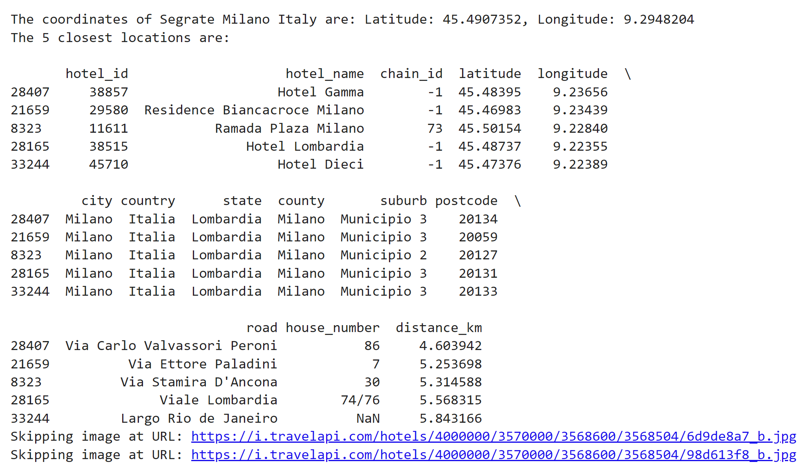

# Building a Multimodal Hotel Recommendation System Using WatsonX.ai and Llava

In this blog, we will explore how to build a hotel recommendation system that combines the power of multimodal models like Llava and IBM's WatsonX.ai. This blog will walk through the necessary code step-by-step, explaining each part and how it contributes to the overall functionality. The system allows us to get hotel recommendations based on user input, analyze hotel photos using a multimodal model, and describe them for better decision-making.

## Environment Setup

We begin by setting up the environment and necessary dependencies. WatsonX.ai and the multimodal model Llava will require credentials, so we'll load those from environment variables.

### Loading Environment Variables

The first step is to load environment variables that contain our API keys and project information.

```python
from dotenv import load_dotenv
from os import environ, getenv
from getpass import getpass

# Load environment variables from .env file
load_dotenv()

# Function to set environment variables
def set_env(var: str):
    env_var = getenv(var)
    if not env_var:
        env_var = getpass(f"{var}: ")
        environ[var] = env_var
    return env_var
```

This function ensures that API keys and project IDs are safely loaded into the environment. If they don't exist, the script will prompt the user to enter them.

### Defining IBM WatsonX.ai Connection Parameters

To connect to WatsonX.ai, we need to define the API key, project ID, and URL for the service.

```python
from pydantic import BaseModel

# Define IBM connection parameters
class IbmConnectionParams(BaseModel):
    api_key: str
    project_id: str
    url: str
    credentials: dict[str, str]

    def __init__(self, api_key: str, project_id: str, url: str) -> None:
        super().__init__(api_key=api_key, project_id=project_id, url=url, credentials={"url": url, "apikey": api_key})
```

Next, we load the IBM connection parameters from environment variables:

```python
# Load IBM connection parameters from environment variables
def load_connection_params() -> IbmConnectionParams:
    api_key = set_env("WATSONX_API_KEY")
    project_id = set_env("PROJECT_ID")
    url = set_env("WATSONX_URL")

    return IbmConnectionParams(api_key=api_key, project_id=project_id, url=url)

connection_params: IbmConnectionParams = load_connection_params()
```

## Initializing the WatsonX Model

We initialize the WatsonX language model with some parameters to control its behavior.

```python
# Define parameters for the model
parameters = {
    "decoding_method": "sample",
    "max_new_tokens": 300,
    "min_new_tokens": 1,
    "temperature": 0.5,
    "top_k": 50,
    "top_p": 1,
}

# Initialize the WatsonxLLM model
watsonx_llm = WatsonxLLM(
    model_id="meta-llama/llama-3-70b-instruct",
    apikey=connection_params.api_key,
    url=connection_params.url,
    project_id=connection_params.project_id,
    params=parameters,
)
```

This section sets up the connection to WatsonX and defines how the model will handle text generation, such as the number of new tokens it can generate and the sampling method.

## Loading Hotel Data

The next step is to ensure that the required data files are available. We use two datasets: geocoded hotels and multimodal hotel information.

```python
import os
import pandas as pd
import requests

# Ensure data files are available
current_directory = os.getcwd()
geocoded_hotels_path = os.path.join(current_directory, 'geocoded_hotels.csv')
csv_file_path = os.path.join(current_directory, 'hotel_multimodal.csv')

# Load geocoded hotels data
if not os.path.isfile(geocoded_hotels_path):
    url = 'https://github.com/ruslanmv/watsonx-with-multimodal-llava/raw/master/geocoded_hotels.csv'
    response = requests.get(url)
    if response.status_code == 200:
        with open(geocoded_hotels_path, 'wb') as f:
            f.write(response.content)
        print(f"File {geocoded_hotels_path} downloaded successfully!")
    else:
        print(f"Error downloading file. Status code: {response.status_code}")
else:
    print(f"File {geocoded_hotels_path} already exists.")
geocoded_hotels = pd.read_csv(geocoded_hotels_path)

# Load hotel dataset
if not os.path.exists(csv_file_path):
    dataset = load_dataset("ruslanmv/hotel-multimodal")
    df_hotels = dataset['train'].to_pandas()
    df_hotels.to_csv(csv_file_path, index=False)
    print("Dataset downloaded and saved as CSV.")
else:
    df_hotels = pd.read_csv(csv_file_path)
```

This ensures the necessary datasets are either downloaded or loaded from the local directory.

## Finding Nearby Hotels

Next, we define functions to get user locations and find hotels nearby. If the user provides a specific place, we retrieve its coordinates using geolocation services.

```python
from geopy.geocoders import Nominatim

def get_coordinates(location_name):
    geolocator = Nominatim(user_agent="coordinate_finder")
    location = geolocator.geocode(location_name)
    if location:
        return location.latitude, location.longitude
    else:
        return None

def find_nearby(place=None):
    if place:
        coordinates = get_coordinates(place)
        if coordinates:
            latitude, longitude = coordinates
            print(f"The coordinates of {place} are: Latitude: {latitude}, Longitude: {longitude}")
        else:
            print(f"Location not found: {place}")
            return None
```

The geocoded hotel data is used to calculate the distance between the current location and nearby hotels. 

## Multimodal Model for Image Analysis

The core of our system is the multimodal model Llava, which can analyze hotel images and provide textual descriptions. We load the model and create a function to handle the image-to-text pipeline.

```python
from transformers import pipeline, AutoTokenizer, AutoProcessor, LlavaForConditionalGeneration

# Constants
DEVICE = "cuda" if torch.cuda.is_available() else "cpu"
MODEL_ID = "llava-hf/llava-1.5-7b-hf"

# Load the tokenizer and processor
tokenizer_image_to_text = AutoTokenizer.from_pretrained(MODEL_ID)
image_processor = AutoImageProcessor.from_pretrained(MODEL_ID)

# Load models only once
model = LlavaForConditionalGeneration.from_pretrained(MODEL_ID)
pipe_image_to_text = pipeline("image-to-text", model=model, tokenizer=tokenizer_image_to_text, image_processor=image_processor)
```

Once the model is ready, we can process hotel images and get descriptions:

```python
from PIL import Image
from io import BytesIO

def search_hotel(place=None):
    df_found = find_nearby(place)
    if df_found is None:
        return pd.DataFrame()

    hotel_ids = df_found["hotel_id"].values.tolist()
    filtered_df = df_hotels[df_hotels['hotel_id'].isin(hotel_ids)]
    
    description_data = []
    for index, row in filtered_df.iterrows():
        image_url = row['image_url']
        try:
            response = requests.get(image_url)
            img = Image.open(BytesIO(response.content))
            prompt = "USER: <image>\nAnalyze this image."
            outputs = pipe_image_to_text(img, prompt=prompt)
            description = outputs[0]["generated_text"]
            description_data.append({'hotel_name': row['hotel_name'], 'description': description})
        except:
            continue
    return pd.DataFrame(description_data)
```

## Generating Recommendations with WatsonX.ai

Finally, we pass the image descriptions to WatsonX.ai to get personalized recommendations based on the hotel's features.

```python
def grouped_description(description_df):
    grouped_descriptions = description_df.groupby('hotel_id')['description'].apply(lambda x: ' '.join(x.astype(str))).reset_index()
    return grouped_descriptions

def build_prompt(context_result):
    hotel_recommendation_template = """
<s>[INST] <<SYS>>
You are a helpful and informative chatbot assistant.
<</SYS>>
Based on the following hotel descriptions, recommend the best hotel:
{context_result}
[/INST]
"""
    return hotel_recommendation_template.format(context_result=context_result)

def llm_results(description_df):
    result_df = grouped_description(description_df)
    context_result = create_prompt_result(result_df)
    prompt = build_prompt(context_result)
    result = watsonx_llm.invoke(prompt)
    return result
```

## Building the User Interface: The Front-End Part

In this section, we'll dive into the Python code snippet that constructs the visual elements of our WatsonX Hotel Recommendation application. We'll be using the Gradio library, a powerful tool for creating intuitive and interactive web interfaces with minimal effort.

**Setting the Stage with Gradio**

```python
import gradio as gr

# Create the Gradio app with custom CSS styling
with gr.Blocks(css="style.css") as demo:
```

We kick things off by importing the `gradio` library and aliasing it as `gr` for convenience. The core of our interface is built within the `gr.Blocks()` context. This acts as the main container for all the visual components we'll add. We've also provided a `css="style.css"` argument, allowing us to apply custom styles defined in an external "style.css" file to enhance the look and feel of our application.

**Crafting the Header**

```python
    # Header
    with gr.Row(elem_id="header"):
        gr.Markdown(
            """
            # 🏨 **WatsonX Hotel Recommendation with Multimodal** 🏨
            Discover the best hotels in any city with personalized recommendations powered by WatsonX!
            """,
            elem_id="title"
        )
```

Next, we create the header using a `gr.Row()`. This ensures the elements within it are arranged horizontally.  The `gr.Markdown()` component lets us add formatted text, including the main title and a brief description of our application.  The `elem_id` attributes give us handles to style these elements precisely in our CSS.

**User Input Area**

```python
    # Input area for place and button
    with gr.Row():
        place_input = gr.Textbox(label="Enter a place", placeholder="E.g., Paris France, Tokyo Japan, Genova Italy")
        send_btn = gr.Button("Search Hotels")
```

Another `gr.Row()` is employed to organize the user input section. Here, we have a `gr.Textbox()` where the user can enter their desired location. The `label` and `placeholder` provide guidance on what to input.  The `gr.Button()` labeled "Search Hotels" triggers the hotel search process when clicked.

**Chatbot Output Area**

```python
    # Output area to show chatbot responses (including images)
    chatbot = MultimodalChatbot(height=600, elem_id="chatbot-output")
```

We anticipate a `MultimodalChatbot` component (not shown in the code snippet) that will handle the display of chatbot responses, including images. This component is likely custom-built or imported from another module. We set its height and provide an `elem_id` for styling.

**Connecting the Dots**

```python
    send_btn.click(chatbot_response, inputs=[place_input, chatbot], outputs=chatbot)
```

Finally, we establish the interaction between the "Search Hotels" button and the chatbot. The `.click()` method links the button's click event to a function named `chatbot_response`. This function will presumably take the user's input, process it using WatsonX, and update the `chatbot` component with the results.

**Launching the Application**

```python
# Launch the Gradio app
demo.launch(debug=True)
```

The last line launches the Gradio application, making it accessible in your web browser. The `debug=True` option enables helpful debugging information in case of errors.

**Example use**
We find Segrate Milano Italy
It will search all the Hotels nearby this place

and it is displayed the top 5 hotels nearby this place with their descriptions comming from the images 


and finally with the use of WatsonX.ai we got the recommendation.

and the recommendation 


## Conclusion

By integrating WatsonX.ai and a multimodal model like Llava, we have built a sophisticated hotel recommendation system. This system analyzes hotel images and provides detailed recommendations, making it a powerful tool for travelers looking for the best accommodation options.

This blog demonstrates how easy it can be to leverage AI for real-world applications such as hotel recommendations. From analyzing photos to providing insightful recommendations, this system offers a complete solution for enhancing the user experience in travel planning.